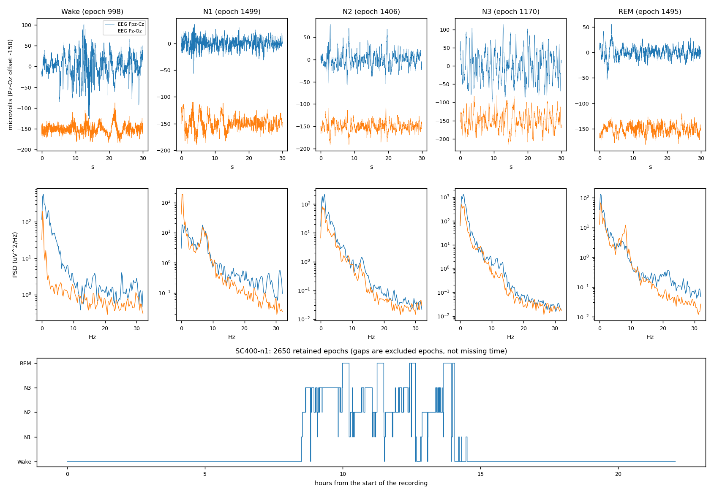

# SleepStateLab

**Self-supervised EEG representation learning and sleep-state decoding.**

The question: *does self-supervised representation learning improve
cross-participant sleep staging when labels are scarce, and does the benefit
concentrate around stage transitions or survive with fewer EEG channels?*

This is a research implementation, not a result. What has been built, what has
been run, and what has not, is stated in the next section and is not softened
anywhere else in this document.

---

## Status — read this before any number below

| | state |
| --- | --- |
| package, configuration, CLI, tests | **implemented** |
| data audit, manifest, epoching, splits | **implemented**, executed on real recordings |
| classical baselines (class prior, logistic regression, random forest) | **implemented**, executed on synthetic and real data |
| D1 — trainable epoch CNN | **implemented**, executed on synthetic and real data |
| D2 — temporal transformer over 11 epochs | **implemented**, executed on synthetic and real data |
| shuffled-neighbour control | **implemented**, executed on real data |
| context-masking control | **implemented**, executed on real data |
| saved-prediction evaluation and generated report tables | **implemented**, executed on synthetic and real data |
| D3 — D2 with a self-supervised pretrained encoder | **specified only** ([contract](docs/model_contracts.md)) — not implemented |
| the 10% / 25% / 100% label-budget benchmark | **not run** |
| the other five required controls | **not run** |
| transition and single-channel analyses | **not run** |

**Executed on real data so far: a six-participant pilot** — four training, one
validation, one test — on Sleep Cassette recordings downloaded from PhysioNet
and verified against the published checksums. A test estimate from one held-out
person is one person's night. It shows the pipeline runs end to end on real
recordings and produces coherent numbers. It is not a benchmark and no
generalisation claim is made from it.

**D1 and D2 have been run at matched compute — on one held-out participant.**
Sharing encodings between overlapping windows made a D2 pass cost the same as a
D1 pass, so D2 has now been trained for the same twenty passes under the same
settings. With one test participant the difference between any two models here
is still not a measurement, and the README does not treat it as one.

There are no pretrained checkpoints, no benchmark results, and no scientific
conclusions in this repository.

---

## What this is, and what PhysioML is

[PhysioML](https://github.com/Elnazkarami/Physiological-Signal-ML-) is the
existing classical-machine-learning and traceability project by the same author.
SleepStateLab is separate and owns neural-network training and representation
learning. PhysioML was read for its verified dataset handling and feature
definitions and **was not modified by this work**; nothing here imports it, and
**SleepStateLab runs with no CDFS deployment of any kind**.

Two components were taken as attributed, versioned extractions — the spectral
feature definitions and the EEG quality-control thresholds — and both name their
origin and revision. What was taken, what was changed, and what was deliberately
left behind is in [docs/physioml_reuse.md](docs/physioml_reuse.md).

**PhysioML's published sleep scores are context, not baselines.** They were
computed on cropped recordings, with four channels including the EOG and chin
EMG, on a different participant set, pooled differently. The classical baselines
are re-run here on matched participants, channels, eligible epochs, labels and
splits, and only those re-run numbers are compared with D1.

The 20-participant development subset **has been used before**, in PhysioML. It
is a development set with a recorded history, not an untouched confirmation
cohort.

---

## Install

```bash
git clone https://github.com/Elnazkarami/sleep-state-lab.git
cd sleep-state-lab
pip install -e ".[dev,plots]"
sleepstatelab doctor --device auto
```

Python 3.11+. `doctor` reports what this machine actually offers:

```
torch 2.8.0
cpu: available
cuda: not available
mps: available
```

**CPU is always selectable** with `--device cpu`, and a run that asks for an
absent accelerator raises rather than silently falling back — a benchmark that
quietly ran for a week on the wrong hardware is worse than one that refused to
start. CUDA and MPS are probed, never assumed. Everything below was executed on
CPU.

## Get the data

Sleep-EDF Expanded 1.0.0, **Sleep Cassette only**:
<https://physionet.org/content/sleep-edfx/1.0.0/>. The dataset is not
redistributed here and nothing in this package downloads it for you. Put the
`SC4*-PSG.edf` and `SC4*-Hypnogram.edf` files under a directory of your
choosing and point `--data-root` at it. Fetching PhysioNet's `SHA256SUMS.txt`
alongside them lets the audit verify each file against its published digest.

---

## Run it

Every command below is one that was actually executed to produce what this
repository contains. `$D` is the data root.

```bash
# 1. discover, pair, validate, and write the manifest
sleepstatelab audit   --config configs/pilot.yaml --data-root $D \
                      --checksums $D/SHA256SUMS.txt --output outputs/manifest.json

# 2. cut every recording into scored 30-second epochs and cache them
sleepstatelab prepare --config configs/pilot.yaml --data-root $D --cache-dir $D/cache

# 3. the audit of one real recording: waveforms, spectra, hypnogram, exclusions
sleepstatelab audit-report --config configs/pilot.yaml --data-root $D \
                      --recording SC400-n1 --out-dir docs/audit

# 4. the participant-disjoint split
sleepstatelab split   --config configs/pilot.yaml --data-root $D --cache-dir $D/cache \
                      --name pilot6 --output outputs/split.json

# 5. classical baselines on the eligible epochs
sleepstatelab baselines --config configs/pilot.yaml --data-root $D --cache-dir $D/cache \
                      --split outputs/split.json --part test \
                      --output outputs/predictions_pilot.csv

# 6. train D1
sleepstatelab train-d1 --config configs/pilot.yaml --data-root $D --cache-dir $D/cache \
                      --split outputs/split.json --device cpu \
                      --checkpoint runs/d1_pilot/checkpoint.pt

# 7. save one prediction row per test epoch
sleepstatelab predict --config configs/pilot.yaml --data-root $D --cache-dir $D/cache \
                      --split outputs/split.json --checkpoint runs/d1_pilot/checkpoint.pt \
                      --part test --output outputs/predictions_pilot.csv --append

# 7b. D2: the same encoder under a transformer over eleven epochs (offline)
sleepstatelab train-d2 --config configs/pilot.yaml --data-root $D --cache-dir $D/cache \
                      --split outputs/split.json --device cpu --epochs 6 \
                      --checkpoint runs/d2_pilot/checkpoint.pt
sleepstatelab predict --config configs/pilot.yaml --data-root $D --cache-dir $D/cache \
                      --split outputs/split.json --checkpoint runs/d2_pilot/checkpoint.pt \
                      --part test --output outputs/predictions_pilot.csv \
                      --model-name D2 --append

# 7c. the control: same model, neighbours shuffled
sleepstatelab predict --config configs/pilot.yaml --data-root $D --cache-dir $D/cache \
                      --split outputs/split.json --checkpoint runs/d2_pilot/checkpoint.pt \
                      --part test --output outputs/predictions_pilot.csv \
                      --model-name D2-shuffled-context --append \
                      --shuffle-context --shuffle-seed 1

# 8. build the tables from the saved predictions
sleepstatelab report  outputs/predictions_pilot.csv --part test \
                      --output docs/results_pilot.md --json outputs/metrics_pilot.json
```

No recordings, credentials, caches or checkpoints are committed: the data root,
the epoch cache, `runs/` and `outputs/` are all ignored.

**With no data at all**, the whole pipeline still runs on generated recordings:

```bash
sleepstatelab smoke --out-dir outputs/smoke
```

It writes real EDF files, reads them back through the same reader, epochs them
with deliberate gaps, splits, trains, checkpoints, reloads, predicts and scores —
and labels every artefact synthetic.

---

## How the data is handled

Full detail in [docs/data_audit.md](docs/data_audit.md); the decisions that
change what a number means:

* **Sleep Cassette only.** Sleep Telemetry files are not matched and are listed
  as ignored, never quietly mixed in.
* **A participant is not a recording.** `SC4001` and `SC4002` are two nights of
  one person and always land in the same split.
* **Pairing is by participant and night**, because the hypnogram's file stem
  differs from the PSG's.
* **Two EEG derivations, in a fixed order**: `EEG Fpz-Cz` then `EEG Pz-Oz`.
  Channel order is part of the model's contract and a checkpoint records it.
* **Units are read, not assumed.** The EDF header is parsed directly for the
  declared physical dimension, because an established reader has already
  converted to volts by the time anything is visible. An unrecognised unit
  raises rather than being scaled by a guess.
* **100 Hz is required, not enforced by resampling.** A recording at another
  rate raises.
* **PSG and hypnogram start times must agree**, or the recording is flagged. If
  they did not, every label would be shifted and nothing downstream would
  notice.
* **Stages 3 and 4 merge into N3**; the original annotation text is stored per
  epoch so the merge can be undone.
* **`Movement time` and `Sleep stage ?` are never labels.** They are exclusions
  with a reason, and they never become wake.
* **Original epoch indices survive.** An excluded epoch leaves a visible jump in
  the index. Nothing treats two rows as neighbours because they are adjacent in
  an array.
* **Primary preparation keeps every valid scored epoch** — no sleep-stage-based
  cropping. Wake is therefore about 70% of the epochs, which is what the
  recordings are. The crop to the annotated sleep interval plus a margin exists
  as a separately labelled sensitivity analysis
  (`configs/sleep_window_sensitivity.yaml`) and is not mixed with primary
  results.
* **Normalisation is fitted on training participants only** — one median and one
  IQR per channel, frozen, hashed, and recorded in every checkpoint. Per-epoch
  z-scoring is available and is *not* the default: it deletes the absolute
  amplitude that separates N3 from N1.

**The audit of one real recording** — checksums, header claims, waveforms and
spectra for each stage, hypnogram alignment, retained counts and every exclusion
— is in [docs/audit/SC400-n1_audit.md](docs/audit/SC400-n1_audit.md), generated
by `sleepstatelab audit-report`.



The eight and a half hours of wake before sleep onset, visible at the left of
the hypnogram, is why the class balance is what it is and why accuracy is not a
metric this repository reports alone.

---

## Splits and leakage

Participant-disjoint train / validation / test, generated deterministically from
a seed. All nights of a participant go to one split — a `Split` that shares a
participant **cannot be constructed**, and a split file carries a hash of its
participant lists so an edited file is detected on load.

**No test participant contributes to** normalisation statistics, hyperparameter
selection, early stopping, calibration, or self-supervised pretraining. The
first is enforced in code, the second and third by selecting only on validation,
and the last is a stated requirement of the D3 contract.

Nested 10% / 25% / 100% training-participant budgets are generated for the
planned benchmark. **As implemented, a reduced budget does not reduce the
validation set** — a 10% run still selects its checkpoint on the full validation
labels, which is more supervision than a true 10%-label setting. Any budget
result must disclose this.

---

## D1 — the trainable epoch CNN

One 30-second epoch in; five logits, an embedding, and temporal tokens out.

```
input          [batch, 2, 3000]        Fpz-Cz first, Pz-Oz second, microvolts
stem           Conv1d(2->32, k=49, s=6) - GroupNorm - GELU - MaxPool2
block 1        2 x Conv1d(k=9) -> 64   - GroupNorm - GELU - MaxPool2
block 2        2 x Conv1d(k=9) -> 96   - GroupNorm - GELU - MaxPool2
block 3        2 x Conv1d(k=9) -> 128  - GroupNorm - GELU - MaxPool2
tokens         [batch, 128, 31]        ~0.5 s of signal each, for D2/D3
embedding      mean-pool + max-pool over time -> Linear -> [batch, 128]
head           Dropout(0.3) -> Linear(128 -> 5) -> five unnormalised logits
```

**489,477 parameters** — 488,832 encoder, 645 head.

* **The head is a separate module.** `D1Classifier.from_encoder(encoder)`
  attaches a fresh head to an existing backbone; that is the seam D2 and D3
  reuse, so their comparison measures initialisation rather than architecture.
* **GroupNorm, not BatchNorm.** Batch statistics would make a prediction depend
  on who else is in the batch, and BatchNorm's running statistics carry a piece
  of the training distribution into inference on a new participant.
* **Initialisation** is Kaiming fan-out for convolutions, Xavier for linear
  layers, written out rather than left to defaults.
* **Loss** is cross-entropy weighted by inverse class frequency, normalised to a
  mean of one, computed on **training participants only**.
* **Optimiser** AdamW, learning rate 1e-3, weight decay 1e-4, cosine schedule,
  gradient-norm clipping at 5.
* **Stopping rule** is validation participant-mean macro-F1, with patience.
  Never loss, never anything measured on test. The checkpoint kept is the best
  validation epoch, and which epoch that was is recorded.

**Every checkpoint carries its contract**: configuration and its hash, seed,
code revision, split identity and participant lists, channel order,
preprocessing identity, normalisation statistics, label order, selected epoch
and its validation score, and the full training history. Loading refuses a
checkpoint whose channel order or preprocessing identity does not match the
configuration it is being loaded into.

---

## D2 — temporal context

The same encoder, applied to eleven consecutive epochs — five before, the
central epoch, five after — then a two-layer transformer across those eleven
embeddings, then the head on the **central position only**.

**756,229 parameters**: 488,832 in the encoder, which is bit-for-bit D1's,
266,752 in the temporal stack, 645 in the head. A test asserts that a D1 and a
D2 built from the same encoder object share it and produce identical embeddings.

**This is an offline model.** Predicting the middle of eleven epochs uses 2.5
minutes of future signal. It is not a real-time scorer and comparing it against
one would be unfair in D2's favour.

**Masking is the part that has to be right**, and it lives in the dataset, not
the model, so a window handed to a model is already correct:

* a window never leaves its recording, so it can never reach into another night
  or another participant;
* position *k* of a window centred on epoch *i* is the epoch whose **original
  index** is `i + k − 5`, or nothing at all. If that epoch was excluded, the
  position is marked absent — the nearest surviving epoch is never substituted,
  because it is a different point in the night;
* the start and end of a recording are absences of the same kind, not zero
  padding, which would teach the model that a boundary looks like a flat signal;
* absent positions get a learned token *and* are excluded from attention;
* the centre is always a real, eligible, labelled epoch, and the model raises if
  it is ever handed a window whose centre is masked.

Every one of those is a test in `tests/test_d2.py`, including the two that
matter most: with all neighbours masked, changing them does not move the logits
at all; with them present, it does.

**Two controls, not one.** `predict --shuffle-context` permutes the neighbours,
which asks whether their *order* is used. `predict --mask-context` marks them
all absent, which asks whether they are used *at all*. They are different
questions and the CLI refuses to run both at once, so a saved result always says
which was asked.

**Genuine-neighbour coverage** — the share of context positions that are real —
is computed per dataset and reported with any D2 run. On the pilot it is 0.999,
because these recordings have almost no excluded epochs; on a noisier cohort it
would be lower and the number says so.

D2 is trained by the same `train_supervised` routine as D1, with class weights
from the same shared helper, so the two cannot drift apart in the ways that
would make their difference mean something other than context.

**Shared encodings.** Overlapping windows share ten of their eleven epochs, so
training and inference encode a contiguous stretch of a recording once and gather
the windows out of it — 32 centres cost 42 encodings rather than 352. On the
pilot that is 14,532 encodings per pass instead of 120,945, and **107 seconds per
pass instead of 827** — the same cost as a D1 pass, which is what made the
matched comparison affordable. It is the
same model: one test asserts the two paths produce the same logits, another that
they produce the same probabilities end to end, and `--no-segments` keeps the
slow path available to check against. The cost is that a batch is several
stretches rather than several independent windows, so its examples are
correlated in time; the encoder carries no batch statistics, so nothing in the
model depends on that.

---

## Evaluation

**Primary metric: macro-F1 computed per participant, then averaged equally
across people.** Pooled macro-F1 is reported beside it and never instead of it —
they are different quantities, and pooling lets whoever contributed the most
epochs decide the number.

One saved row per participant / recording / epoch / model / run, carrying the
true label, the predicted label and **all five probabilities**. Every table in
this repository is generated from those rows by `sleepstatelab report`. No score
is typed into documentation.

Absent classes, within a participant: a stage with **no true and no predicted**
epochs is omitted from that participant's macro average; a stage present in
either the truth or the predictions scores F1 = 0 when it is missed. Every
per-stage table says how many participants it was averaged over.

Also reported: stage support, per-stage precision / recall / F1, balanced
accuracy, Cohen's κ, the confusion matrix, quality-control coverage, and the
per-participant spread. Full protocol in
[docs/evaluation.md](docs/evaluation.md).

---

## Results

### The six-participant pilot, on real recordings

Six Sleep Cassette participants, one night each, downloaded from PhysioNet and
verified against the published SHA-256 digests. Primary preparation: every valid
scored epoch, no cropping. **16,367 epochs stored, 16,366 eligible** after
quality control — one epoch rejected as clipped, one excluded as movement time.
Split `4b13bdea21d4fdad`: train `SC400 SC402 SC403 SC405`, validation `SC401`,
test `SC404`. Wake is 70.6% of the labelled epochs, which is what these
recordings are.

D1 trained on CPU: 10,995 training epochs, 20 passes at 82–152 s each, best
validation participant macro-F1 **0.8085 at epoch 16**, which is the checkpoint
kept. Class weights from training participants only:
`[0.073, 2.31, 0.396, 1.171, 1.051]` for Wake / N1 / N2 / N3 / REM.

D2 trained on the same CPU over the same 10,995 centres, **six passes at 772–1,355 s
each**, best validation participant macro-F1 **0.8129 at epoch 5**. Genuine-neighbour
coverage 0.999. Identical class counts and weights to D1's, by construction.

**One held-out participant. This is a pipeline demonstration, not a benchmark**,
and the ± 0.000 in the table is the standard deviation over a single person — it
is not a measure of anything.

| model | participant macro-F1 | pooled macro-F1 | balanced acc. | Cohen's kappa | accuracy | epochs | participants |
| --- | ---: | ---: | ---: | ---: | ---: | ---: | ---: |
| random_forest | 0.717 ± 0.000 | 0.717 | 0.705 | 0.757 | 0.859 | 2569 | 1 |
| D1 | 0.702 ± 0.000 | 0.702 | 0.748 | 0.743 | 0.847 | 2569 | 1 |
| D2 | 0.644 ± 0.000 | 0.644 | 0.718 | 0.679 | 0.807 | 2569 | 1 |
| D2-shuffled-context | 0.644 ± 0.000 | 0.644 | 0.713 | 0.680 | 0.807 | 2569 | 1 |
| logistic | 0.626 ± 0.000 | 0.626 | 0.644 | 0.689 | 0.815 | 2569 | 1 |
| D2-context-masked | 0.552 ± 0.000 | 0.552 | 0.661 | 0.660 | 0.802 | 2569 | 1 |
| class_prior | 0.150 ± 0.000 | 0.150 | 0.200 | 0.000 | 0.597 | 2569 | 1 |

| participant | D1 | D2 | D2-context-masked | D2-shuffled-context | class_prior | logistic | random_forest |
| --- | ---: | ---: | ---: | ---: | ---: | ---: | ---: |
| SC404 | 0.702 | 0.644 | 0.552 | 0.644 | 0.150 | 0.626 | 0.717 |

The class-prior row is why accuracy is not reported alone: answering "wake"
every time scores **59.7% accuracy** on these recordings, with κ exactly zero
and participant macro-F1 of 0.150.

D1 lands between logistic regression and the random forest on this one
participant, and is beaten by the random forest on macro-F1 (0.702 vs 0.717) and
κ (0.743 vs 0.757) while having the better balanced accuracy (0.748 vs 0.705).
On one person, with three-quarters of the training signal being wake, **none of
those differences should be read as a ranking.**

#### The context controls: what they say, and what they do not

Two controls, asking two different questions of the same trained model. Both are
run from saved predictions like everything else.

**Shuffled neighbours** permutes the ten non-central positions of every window,
keeping the centre and the amount of real context fixed. **Masked context**
marks every non-central position absent, which reduces D2 to its encoder on the
central epoch — an input the model already knows how to handle, because that is
what a recording boundary looks like.

| | 6 passes | 20 passes (matched to D1) |
| --- | ---: | ---: |
| D2 | 0.644 | 0.576 |
| D2, neighbours shuffled | 0.644 | 0.571 |
| D2, context masked | 0.552 | 0.481 |

Participant macro-F1 on the held-out participant. The two D2 runs are separate
prediction files: [docs/results_pilot.md](docs/results_pilot.md) and
[docs/results_d2_controls.md](docs/results_d2_controls.md).

**The context is being used.** Removing it costs about 0.09 macro-F1 in both
runs. **Its order is not.** Shuffling costs 0.000 and 0.005.

So D2 reads its neighbourhood as an unordered summary — how much of the
surrounding five minutes looks like slow-wave sleep, say — rather than as a
sequence. That is a real use of context and a weaker one than the architecture
allows; a transformer with learned positional embeddings is free to use order
and, here, does not.

Two things follow that matter more than the numbers. First, **the shuffled
control alone cannot support the claim that context is unused** — a model that
averages its neighbours is invariant to shuffling while depending on them
completely. That is why the masking control exists, and it is why the earlier
reading of the six-pass run was wrong. Second, **"D2 was undertrained" is no
longer the explanation**: at compute matched to D1 the pattern is the same, and
if anything stronger.

What this does not establish: that order is unusable on this task. Four training
participants, one validation participant deciding which checkpoint is kept, and
one test participant is not a setting in which an absence of evidence means very
much. The validation score swung between 0.33 and 0.80 across passes, so
checkpoint selection here is substantially noise.

#### D2, per stage

| stage | precision | recall | F1 (pooled) | F1 (participant mean) | support | participants |
| --- | ---: | ---: | ---: | ---: | ---: | ---: |
| Wake | 0.986 | 0.950 | 0.968 | 0.968 | 1534 | 1 |
| N1 | 0.297 | 0.542 | 0.384 | 0.384 | 166 | 1 |
| N2 | 0.963 | 0.585 | 0.728 | 0.728 | 620 | 1 |
| N3 | 0.575 | 0.943 | 0.714 | 0.714 | 53 | 1 |
| REM | 0.344 | 0.566 | 0.428 | 0.428 | 196 | 1 |

D2 recovers more N3 than D1 (recall 0.943 against 0.868) and much less N2
(0.585 against 0.698). On one participant that is a description of one night,
not a property of the architecture.

N1 is the stage every automatic scorer struggles with, and it is 3.3% of these
recordings; D1 recovers 52.4% of it at 33.5% precision. The REM row shows the
cost of a single-epoch model with no EOG: REM is recalled at 0.689 but with
0.434 precision, most of the confusion being with N1 and N2. That is exactly the
gap temporal context is meant to close, and it is what D2 exists to test.

The full generated report — every model, per-stage tables, confusion matrices,
quality-control coverage — is in
[docs/results_pilot.md](docs/results_pilot.md). It was produced by
`sleepstatelab report` from the 10,276 saved prediction rows and pasted here
unchanged. The pilot's evidence is committed alongside it: the manifest
([docs/pilot_manifest.json](docs/pilot_manifest.json), with local paths reduced
to file names), the split ([docs/pilot_split.json](docs/pilot_split.json)) and
the metrics ([docs/pilot_metrics.json](docs/pilot_metrics.json)). The prediction
rows themselves are not committed — they are regenerated by the commands above
— and neither are the recordings, the epoch cache, or the checkpoint.

### Synthetic results

The smoke run's numbers are in `outputs/smoke/report_synthetic.md` when you run
it, and they describe generated signals with a known spectrum per stage. They
are not reproduced here, because a number computed on synthetic sleep invites
exactly the misreading this section is written to prevent.

---

## Verification

### Automated checks

```
$ ruff check src tests
All checks passed!

$ pytest -q
88 passed in 113.61s
```

All 88 tests run on generated signals and require no recordings. What each one
asserts, and which failure it exists to catch, is tabulated in
[docs/verification.md](docs/verification.md). The checks the brief calls for,
and where they live:

| required check | status |
| --- | --- |
| annotation alignment | passed — run expansion, misalignment reported, double-scoring counted, PSG/hypnogram start times compared |
| units | passed — declared dimension parsed from the header; a millivolt file comes back exactly 1,000× a microvolt one; an unknown unit raises |
| label mapping | passed — stage 4 → N3, movement and unscored never become labels, original text retained |
| participant separation | passed — a sharing split cannot be constructed; datasets, normalisation and class weights all checked |
| gap handling | passed — excluded epochs leave visible index jumps; adjacency is decidable |
| checkpoint round-trip | passed — reloaded model predicts identically; wrong channel order or preprocessing identity is refused |
| metric calculation | passed — κ against a hand-worked example, absent-class rule both ways, participant-average vs pooled |
| D2 masking | passed — gaps and boundaries masked not bridged, absent context provably ignored, present context provably used, centre always real |
| D1/D2 comparability | passed — identical class counts and weights from a shared helper, one shared training routine |
| the repository contains its own source | passed — no source file is git-ignored, every subpackage imports |

### Synthetic CPU smoke pipeline

```
$ sleepstatelab smoke --out-dir outputs/smoke
SYNTHETIC smoke run on cpu. Nothing here is a result.

1. generated 6 synthetic night(s) as EDF under .../sleep-edf
2. prepared: 222 epochs, 222 eligible
   exclusions: {"movement_time": 6, "unscored": 12, ...}
   deliberate gaps preserved in the epoch indices: 12
3. synthetic [4b13bdea21d4fdad] grouped_random seed=20260901: train 4 / val 1 / test 1
4. train 148 / val 37 / test 37 epochs; normalization train_robust_channel
   fitted on ['SC400', 'SC402', 'SC403', 'SC405']
5. trained D1
6. checkpoint reloaded; split id round-trip True
7. baselines fitted: class_prior, logistic, random_forest
8. predictions saved
9. report written
10. overfit check: loss 3.284 -> 0.0020, train accuracy 1.000
```

**The overfit check** is the optimisation test for a new architecture: D1 is
asked to memorise sixteen synthetic epochs. Cross-entropy falls from 3.284 to
0.0020 with training accuracy 1.000. A network that cannot do this has a broken
gradient path, and no amount of real data would show it as clearly. It is not an
experiment and it is not evidence about sleep.

---

## What is not claimed

* No result for D2, D3, pretraining, label budgets, transitions, or channel
  ablations exists. Those are contracts in
  [docs/model_contracts.md](docs/model_contracts.md), and the controls that must
  accompany them — a pretrained CNN without context, frozen random versus frozen
  pretrained probes, a compute-matched longer-trained D2, a temporal-smoothing
  baseline, shuffled-neighbour controls, and one-channel models trained as such
  — are listed there and have not been run.
* Nothing here claims sleep stages are attractors, that transitions are
  bifurcations, or that any embedding structure is a mechanism or a clinically
  useful biomarker. Classification performance and a two-dimensional projection
  of a 128-dimensional embedding cannot establish any of that.
* The pilot is six participants. It is not a cohort.

**Not for clinical use.**

---

## Layout

```
configs/            default, pilot, and the sleep-window sensitivity analysis
src/sleepstatelab/
  labels.py         the five stages and the annotation map, defined once
  config.py         typed configuration; unknown keys are an error
  devices.py        explicit CPU, probed CUDA/MPS, no silent fallback
  provenance.py     run records, file checksums, code revision
  synthetic.py      generated recordings written as real EDF files
  smoke.py          the synthetic end-to-end run and the overfit check
  data/             discovery, EDF header, annotations, epochs, QC,
                    preprocessing, splits, cache preparation, audit report
  features/         spectral features (classical baselines only)
  baselines/        class prior, logistic regression, random forest
  models/           the epoch encoder, D1, and D2's temporal stack
  training/         epoch dataset, context windows, trainer, checkpoints
  evaluation/       saved predictions, metrics, generated report tables
tests/              88 tests: synthetic, real-data-free, CPU
docs/               data audit, model contracts, evaluation, PhysioML reuse
```

---

© 2026 Elnaz Alikarami. All rights reserved. See [LICENSE](LICENSE).
Sleep-EDF Expanded is used under its own terms (Open Data Commons Attribution
License v1.0) and is not redistributed here.
